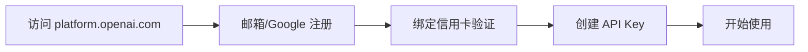

# 🚀 主流 AI 模型 API 平台全景指南

## 注册、模型、价格与选型建议（2025 年版）

---

## 引言：AI 平台的百花齐放时代

想象一下：你正在开发一个 AI 应用，面前摆着 **21 个不同的 AI 平台**，每个都声称自己是"最强"、"最快"或"最便宜"。这就像走进一家超市，货架上摆满了各种品牌的商品——你该如何选择？

**国际舞台**：OpenAI 的 GPT 系列不再是唯一选择。Anthropic 的 Claude 以安全性著称，Google 的 Gemini 拥有超长上下文，Meta 的 Llama 4 开源免费，还有 Mistral、Groq 等新秀崭露头角。

**中国力量**：阿里云的通义千问、百度的文心一言、智谱的 ChatGLM、月之暗面的 Kimi……中国大模型在中文理解、性价比和本地化服务上展现出强大竞争力。

> **本指南的价值**：
> 我们将带你深入了解 **21 个主流 AI API 平台**（13 个国际 + 8 个中国），从注册到选型，从免费额度到计费策略，帮你找到最适合你的那一个。

### 你将学到什么

✅ **平台定位与核心优势** —— 每个平台的独特卖点
✅ **代表性模型介绍** —— 最新、最强的模型都在这里
✅ **注册完整流程** —— 手把手教你获取 API Key
✅ **免费额度与计费策略** —— 省钱秘籍大公开
✅ **场景化选型建议** —— 根据你的需求精准匹配

---

## 目录导航

> **快速跳转提示**：点击下方链接可直接跳转到对应章节

### 第一部分：国际 AI 平台（13 个）

| # | 平台 | 核心特点 | 免费额度 |
|---|------|---------|---------|
| 1 | [OpenAI](#1-openai--商业化-ai-的奠基者) | 🏆 GPT-5 旗舰模型 | GPT-4o mini 免费层 |
| 2 | [Anthropic](#2-anthropic--安全优先的高质量模型提供商) | 🛡️ 安全优先，Claude 4.5 | $5 免费额度 |
| 3 | [Google AI (Gemini)](#3-google-ai-gemini--深度集成-google-生态) | 🔍 超长上下文 1M tokens | 15 RPM 免费 |
| 4 | [Together AI](#4-together-ai--开源模型的首选推理平台) | 🌟 开源模型首选 | $25 免费额度 |
| 5 | [Fireworks AI](#5-fireworks-ai--高性能推理与企业级-sla) | ⚡ 高性能推理 | $1 免费额度 |
| 6 | [Perplexity](#6-perplexity--联网推理与研究导向) | 🌐 联网实时搜索 | Pro 用户 $5/月 |
| 7 | [Mistral AI](#7-mistral-ai--欧洲轻量高效代表) | 🇪🇺 欧洲代表 | $500 免费额度 |
| 8 | [OpenRouter](#8-openrouter--多模型统一接入层聚合平台) | 🔀 300+ 模型聚合 | $1 试用额度 |
| 9 | [Groq](#9-groq--超高速推理引擎) | 🚀 625 tokens/秒 | 免费层 |
| 10 | [Replicate](#10-replicate--按需运行-ai-模型) | 🎨 图像/视频生成 | 按秒计费 |
| 11 | [Hugging Face](#11-hugging-face--开源模型中心) | 📚 100万+ 开源模型 | 每月免费额度 |
| 12 | [Cohere](#12-cohere--企业级-nlp-解决方案) | 🏢 企业级 NLP | 5000 单位/月 |
| 13 | [AI21 Labs](#13-ai21-labs--任务型-api-专家) | 📝 任务型 API | $10（3个月） |

### 🇨🇳 第二部分：中国本土 AI 平台（8 个）

| # | 平台 | 核心特点 | 免费额度 |
|---|------|---------|---------|
| 14 | [阿里云百炼（通义千问）](#14-阿里云百炼通义千问) | 🧠 Qwen3-Max 1T 参数 | 100万 tokens |
| 15 | [腾讯混元](#15-腾讯混元) | 🎮 MoE 完全开源 | 100万 tokens |
| 16 | [百度千帆（文心一言）](#16-百度千帆文心一言) | 🥇 ERNIE 5.0 国内第一 | ERNIE 3.5 免费 |
| 17 | [智谱 AI（ChatGLM）](#17-智谱-aichatglm) | 💰 超低价 ¥10/亿 tokens | Flash 免费 |
| 18 | [月之暗面（Kimi）](#18-月之暗面kimi) | 🤖 K2 Thinking Agent | ¥15 额度 |
| 19 | [MiniMax](#19-minimax) | 🎵 音视频生成专长 | 1亿 tokens |
| 20 | [字节豆包](#20-字节豆包) | 📱 抖音生态集成 | 50万 tokens/月 |
| 21 | [讯飞星火](#21-讯飞星火) | 🎤 语音技术领先 | Lite 永久免费 |

### 📊 第三部分：对比与选型

- 📈 [国际平台横向对比表](#国际平台横向对比表2025-q4)
- 📉 [中国平台横向对比表](#中国平台横向对比表2025-q4)
- 🎯 [选型建议](#选型建议根据你的需求选择平台)

---

## 第一部分：国际 AI 平台

> **阅读提示**：每个平台都包含核心模型、注册流程、价格和适用场景四个部分，建议先浏览感兴趣的平台，再深入了解细节。

---

### 1. OpenAI —— 商业化 AI 的奠基者

**平台标签**：🥇 行业领导者 | 🔥 最强旗舰模型 | 📚 文档完善 | 💼 商业首选

#### 🤖 核心模型

> **明星产品**：GPT-5 —— 2025年8月发布的最新旗舰模型

**GPT-5 系列**（统一系统，双模式）

- **GPT-5-Low**：快速响应模式，适合日常对话
- **GPT-5-High**：深度思考模式，适合复杂推理
- **性能指标**：
  - 数学能力：AIME 2025 达到 **94.6%**
  - 编程能力：SWE-bench 达到 **74.9%**
  - 多模态：MMMU 达到 **84.2%**
- **质量提升**：
  - 相比 GPT-4o，事实错误率降低 **45%**
  - 思考模式下，错误率降低 **80%**

**其他模型家族**

- **GPT-4.5**（2025年2月）：过渡模型，性能介于 GPT-4o 和 GPT-5 之间
- **GPT-4o**：多模态旗舰，支持图像+文本，低延迟
- **GPT-4o mini**：轻量版，性价比高，提供免费层
- **o1/o3 系列**：深度推理优化，适合数学、科学问题

#### 注册流程



**详细步骤**：

1. 访问 [OpenAI Platform](https://platform.openai.com)


2. 使用邮箱或 Google 账号注册
3. **绑定信用卡**（即使使用免费试用也需验证）


4. 进入 [API Keys 页面](https://platform.openai.com/api-keys) 创建密钥


> **中国用户注意**：
>
> - 中国内地手机号无法完成短信验证
> - 建议使用海外手机号或教育邮箱
> - 需要稳定的网络环境访问

#### 免费额度与价格

| 模型 | 输入价格 | 输出价格 | 免费额度 |
|------|---------|---------|---------|
| **GPT-5** | $5/1M tokens | $15/1M tokens | Pro 用户更多配额 |
| **GPT-4o** | $5/1M tokens | $15/1M tokens | - |
| **GPT-4o mini** | $0.15/1M tokens | $0.6/1M tokens | ✅ 免费层 |
| **o1/o3 系列** | $15-60/1M tokens | - | - |

#### 适合场景

**强烈推荐**：

- **商业产品开发**：稳定性和可靠性最高
- **文档质量要求高**：官方文档和社区支持最完善
- **多模态应用**：图像+文本处理能力最强
- **前沿研究**：最新模型技术的试验田

**不太适合**：

- 预算极度有限的个人项目（考虑使用 mini 版本）
- 需要强中文能力的应用（考虑国内平台）
- 需要完全开源的项目（考虑 Llama 等）

#### 附带的学习资源

OpenAI官方提供的模型使用教程


---

### 2. Anthropic —— 安全优先的高质量模型提供商

**平台标签**：🏅 编程之王 | 🤖 Agent 专家 | 🔒 安全可靠 | 📄 长文本处理

#### 核心模型

> **明星产品**：Claude Sonnet 4.5 —— 世界最佳编程模型（2025年9月29日）

**Claude 4 系列家族**

| 模型 | 发布时间 | 核心特点 | 最佳用途 |
|------|---------|---------|---------|
| **Sonnet 4.5** | 2025.09.29 | 🥇 世界最佳编程模型 | 复杂 Agent、编程任务 |
| **Opus 4.1** | 2025.08.05 | 🧠 推理和真实编程优化 | Agent 任务、高难度推理 |
| **Haiku 4.5** | 2025.10.15 | ⚡ 小而快速 | 低延迟应用、批量处理 |
| **Sonnet 4 / Opus 4** | 2025.05.22 | 🏗️ Claude 4 家族基础 | 通用任务 |

**Claude Sonnet 4.5 亮点**：

- **世界最佳编程模型**：在编程基准测试中超越所有竞争对手
- **构建复杂 Agent 的最强模型**：多步骤任务规划和执行能力卓越
- **电脑使用能力最佳**：可以理解和操作图形界面
- **推理和数学能力显著提升**：逻辑推理准确率大幅提高

#### 注册流程

**步骤概览**：

1. 访问 [Anthropic Console](https://console.anthropic.com)
2. 注册账号并完成邮箱验证


3. 部分区域需**申请 API 访问权限**（1-3 个工作日）
4. 审核通过后，在 [API Keys 页面](https://console.anthropic.com/settings/keys) 创建 Key


> **注册小贴士**：
>
> - 大部分地区可以直接注册使用
> - 部分地区需要等待审核，通常 1-3 个工作日

#### 价格

**定价表**：

| 模型 | 输入价格 | 输出价格 | 性价比评级 |
|------|---------|---------|-----------|
| **Haiku 4.5** | $0.25/1M | $1.25/1M | ⭐⭐⭐⭐⭐ 极高 |
| **Sonnet 4.5** | $3/1M | $15/1M | ⭐⭐⭐⭐ 高 |
| **Opus 4.1** | $15/1M | $75/1M | ⭐⭐⭐ 中等 |

> **价格对比**：
>
> - Haiku 4.5 是性价比之王，适合大规模部署
> - Sonnet 4.5 价格比 GPT-5 便宜 40%，但编程能力更强
> - Opus 4.1 适合最高难度的推理任务

#### 适合场景

**强烈推荐**：

- **代码生成与审查**：世界最佳编程模型
- **复杂 Agent 开发**：多步骤任务规划和执行
- **长文本生成**：论文、报告、技术文档（200K+ 上下文）
- **金融、法律领域**：对输出安全性和准确性要求极高
- **学术研究**：需要深度推理和逻辑分析

**不太适合**：

- 图像生成（Claude 不支持图像生成）
- 预算极度有限的项目（考虑使用 Haiku 版本）

---

### 3. Google AI (Gemini) —— 大善人

#### 核心模型

- **Gemini 2.5 Pro**（2025年当前最强，LMArena排名#1）
  - 思考模型，推理前进行深度思考
  - 数学与科学基准领先（GPQA、AIME 2025）
  - SWE-Bench Verified得分63.8%
  - Humanity's Last Exam无工具18.8%
- **Gemini 2.5 Flash / Flash-Lite**（2025年9月更新，更高质量和效率）
- **Gemini 3.0**（已经发布11月预览版）
  - 1M上下文限制
  - 更强大的AI Agent能力
  - 增强多模态、编程能力

#### 注册流程

1. 访问 [https://aistudio.google.com](https://aistudio.google.com) 或 [Vertex AI Console](https://console.cloud.google.com/vertex-ai)


2. 使用 Google 账号登录
3. 启用 **Gemini API**（需在 Cloud Console 中启用 billing）
4. 创建 **API Key** 或使用 **Service Account**（推荐后者用于生产）


> 💡 小技巧：Google AI Studio 提供"临时聊天"功能，无需配置即可测试模型。


#### 免费额度与价格

- **免费层**：5-15 RPM（每分钟请求数），允许商业使用，100万token上下文可用
- **新用户**：$300 Google Cloud 信用（有效期 90 天）（需要国外信用卡，并且会预扣费）
- **Gemini 2.5 Pro**：输入 $3.5/1M tokens，输出 $10.5/1M tokens
- **Gemini 2.5 Flash**：输入 $0.35/1M tokens（性价比极佳）
- **Gemini 3.0**：价格待公布（即将发布）

#### 适合场景

- 与 Google Workspace（Docs、Gmail）深度集成
- 处理超长文档（1M tokens 支持）
- 图像+文本多模态任务（如 PDF 解析）

---

### 4. Together AI —— 开源模型的首选推理平台


#### 核心模型

- **Llama 4 系列**（2025年4月发布，最新！）
  - **Llama 4 Scout**：17B激活参数（16专家），10M tokens上下文
  - **Llama 4 Maverick**：17B激活参数（128专家），击败GPT-4o和Gemini 2.0 Flash
  - **Llama 4 Behemoth**：训练中，超越GPT-4.5和Claude Sonnet 3.7
- **Llama 3.1 405B / 70B / 8B**（上一代）
- **Mixtral 8x22B**
- **Qwen 2.5 / 3, Yi 1.5, DeepSeek-Coder**
- 支持自定义微调模型部署

#### 注册流程

1. 访问 [https://together.ai](https://together.ai)
2. 使用 GitHub 或邮箱注册
3. 登录后自动就会被要求购买额度（真是太可恶了）
4. 进入 [API Keys 页面](https://api.together.xyz/settings/api-keys) 创建 Key


#### 免费额度与价格

- **免费额度**：无
- **Llama 3 8B Lite**：$0.10/1M tokens（比 GPT-4o-mini 便宜 6 倍）
- **Llama 3.1 70B**：$0.8/1M tokens
- **Llama 3.1 405B**：约 $3/1M tokens
- 支持按秒计费（适合间歇性调用）

#### 适合场景

- 开源模型性能对比实验
- 学术研究、课程项目
- 需要长上下文（128K+）且控制成本

---

### 5. Fireworks AI —— 高性能推理与企业级 SLA


#### 核心模型

- **Llama 4 Scout / Maverick**（2025年4月首发，最快Llama 4 API！）
  - Llama 4 Maverick：400B总参数，17B激活参数，128专家
  - 吞吐量：145 tokens/秒（H200）
  - 100万token上下文窗口
  - 原生多模态（文本+图像理解）
- **Llama 3.1 系列（官方优化版）**
- **Mixtral, Phi-3, Code Llama**
- 自研 **Firefunction V2**（函数调用优化）


#### 注册流程

1. 访问 [https://fireworks.ai](https://fireworks.ai)
2. 注册账号（支持 GitHub / Google）
3. 自动发放 **$1 免费额度**
4. 进入 [API Keys 页面](https://dashboard.fireworks.ai/api-keys) 创建 Key


#### 免费额度与价格

- **免费额度**：$1（无需绑卡）
- **Llama 3.1 70B**：$0.9/1M tokens
- **支持 P99 延迟 <500ms** 的 SLA 保障
- 提供专用实例（Dedicated Endpoints）用于高并发

#### 适合场景

- 需要最快Llama 4推理速度的应用
- 低延迟要求的实时应用（如聊天机器人）
- 生产环境部署（P99延迟<500ms SLA保障）
- 需要函数调用（function calling）高精度的项目
- 多模态应用（文本+图像处理）

---

### 6. Perplexity —— 联网推理与研究导向


#### 核心模型

- **Sonar (Small / Medium / Large)**：联网实时回答
- **支持调用最新模型**（通过统一接口）：
  - **GPT-5** (OpenAI 2025年8月)
  - **Claude Sonnet 4.5** (Anthropic 2025年9月)
  - **Llama 4 Scout / Maverick** (Meta 2025年4月)
  - 以及 Gemini 2.5 等主流模型

#### 注册流程

1. 访问 [https://www.perplexity.ai](https://www.perplexity.ai)
2. 使用 Google 或邮箱注册
3. API 访问在 [Perplexity API 页面](https://docs.perplexity.ai/docs/api-keys) 获取
4. Pro 用户包含 $5/月 API 额度

#### 免费额度与价格

- **免费额度**：Pro 用户包含 $5/月 API 信用（需要绑定信用卡）
- **Sonar Small**：$0.2/1M tokens
- **Sonar Large**：$5/1M tokens
- 联网查询不额外收费

#### 适合场景

- 实时信息检索（如新闻、股价、学术进展）
- 构建"会联网"的 AI 助手
- 学术研究型问答系统

---

### 7. Mistral AI —— 欧洲轻量高效代表


#### 核心模型

- **Magistral Small / Medium**（2025年6月，推理模型）
  - Chain-of-thought推理能力
  - Magistral Small开源
- **Mistral Small 3.2**（2025年6月）
  - 改进指令遵循、输出稳定性、函数调用
- **Mistral Medium 3**（2025年5月7日）
- **Mistral Large 2.1 / 24.11**
- **Codestral 25.01**（代码生成专用）
- **Mistral Small 3.1**（2025年3月，轻量高效）
- **Pixtral Large**（多模态）

#### 注册流程

1. 访问 [https://console.mistral.ai](https://console.mistral.ai)
2. 注册账号（需邮箱验证）
3. 需要绑定手机号（支持+86手机号）
4. 在 [API Keys 页面](https://console.mistral.ai/api-keys) 创建 Key
5. 可选绑定支付方式（支持 PayPal）
6. 注意选择订阅计划，选择免费的即可


#### 免费额度与价格

- **免费额度**：$500 免费 API 额度（新用户）
- **Pixtral 12B**：免费（在 le Chat 和 API 中）
- **Mistral Large 2**：输入 $2/1M tokens，输出 $6/1M tokens
- **Codestral**：价格下降 80%，现为 $0.2/1M tokens
- **Mistral Nemo**：价格下降 50%

#### 适合场景

- 欧洲开发者（数据合规）
- 代码生成与补全
- 资源受限设备的轻量推理
- 预算有限的原型开发（免费额度慷慨）

---

### 8. OpenRouter —— 多模型统一接入层（聚合平台）

#### 核心特点

- 聚合所有主流平台的**最新模型**（300+ 模型）：
  - **GPT-5**（OpenAI 2025年8月）
  - **Claude 4 系列**（Sonnet 4.5, Opus 4.1, Haiku 4.5）
  - **Llama 4**（Scout, Maverick）
  - **Gemini 2.5 Pro**（Google）
  - **Qwen3-Max, ERNIE 5.0** 等中国模型
- 统一 API 接口，一次集成即可切换模型
- 支持自定义 HTTP-Referer 和 X-Title，鼓励开源透明
- 支持 BYOK（Bring Your Own Key）：首 100 万请求/月免费

#### 注册流程

1. 访问 [https://openrouter.ai](https://openrouter.ai)
2. 使用 GitHub / Google / Apple 登录
3. 进入 [Keys 页面](https://openrouter.ai/settings/keys) 创建 API Key
4. （可选）绑定信用卡启用付费

#### 免费额度与价格

- **免费额度**：$1 试用额度
- **BYOK**：首 100 万请求/月免费，之后收取底层成本的 5%
- **直接使用**：价格 = 底层模型价格 + 5.5% 平台服务费（最低 $0.80）
- 加密货币支付收取 5% 手续费
- 无隐藏费用，用量透明

#### 适合场景

- 快速原型开发与模型对比
- 开源项目（支持 Referer 标注）
- 不想管理多个 API Key 的轻量项目
- 探索 300+ 模型的开发者

---

### 9. Groq —— 超高速推理引擎


#### 核心特点

- 基于自研 LPU（Language Processing Unit）芯片
- **世界最快推理速度**：
  - Llama 4 达到 **625 tokens/秒**（业界最快！）
  - SRAM带宽 80TB/秒，比GPU HBM快10倍
- Meta官方Llama 4 API推理引擎（2025年4月合作）
- IBM战略合作伙伴（2025年10月）：速度快5倍，成本更低

#### 核心模型

- **Llama 4 Scout / Maverick**（2025年4月发布当日上线！）
  - 400B总参数，17B激活参数
  - 吞吐量：625 tokens/秒
- **Llama 3.1 405B / 70B / 8B**
- **Mixtral 8x7B**
- **Gemma 7B**


#### 注册流程

1. 访问 [https://console.groq.com](https://console.groq.com)
2. 注册账号，谷歌邮箱或者Github账号最方便
3. 在控制台获取免费 API Key


#### 免费额度与价格

- **免费层**：提供免费 API 访问（有速率限制）
- **Developer Tier**：按 token 付费，价格竞争力强
- **Enterprise Tier**：定制化解决方案


#### 适合场景

- **需要极速推理的应用**（625 tokens/秒，业界最快）
- 需要极低延迟的实时应用（聊天机器人、实时翻译）
- 大规模推理任务（企业级部署）
- 成本敏感的生产环境（比GPU便宜且快5倍）
- Llama 4多模态应用

---

### 10. Replicate —— 按需运行 AI 模型

#### 核心特点

- 运行 AI 模型的云平台，无需管理基础设施
- 支持文本、图像、视频、音频生成等多种AI模型
- 按实际运行时间计费

#### 热门模型（2025年11月最新）

- **Llama 4 Scout / Maverick**（Meta 2025年4月，多模态）
- **Veo 3.1**（Google 视频生成，最新！）
  - 支持参考图像、首尾帧控制
  - 增强的图像转视频功能
- **Seedance Pro**（文本/图像转视频，480p/1080p，5s/10s）
- **SDXL**（Stable Diffusion XL图像生成）
- **Meta MusicGen**（音乐生成）
- 数字人视频生成（单图+音频+文本）

#### 注册流程

1. 访问 [https://replicate.com](https://replicate.com)
2. 使用 GitHub 或邮箱注册
3. 在控制台创建 API Token

#### 免费额度与价格

- **按时间计费**：
  - CPU：$0.0001/秒（公开模型）
  - Nvidia T4 GPU：$0.000225/秒（公开模型）
  - 8x H100 GPU：约 $0.0122/秒
- **按输出计费**（部分模型）：
  - Veo 3.1：约 $0.50/秒视频
  - Seedance Pro：约 $0.098/秒视频
  - Llama 4：按token计费（具体见模型页面）

#### 适合场景

- 视频生成（Veo 3.1, Seedance Pro）
- 图像生成（SDXL, 数字人）
- 音频/音乐生成（MusicGen）
- 多模态应用（Llama 4 Scout/Maverick）
- 快速测试最新开源模型
- 无需部署基础设施的创意项目

---

### 11. Hugging Face —— 开源模型中心


#### 核心特点

- **全球最大的开源 AI 模型社区**（100万+ 模型）
- 提供 Inference API 和 Inference Endpoints
- **托管所有最新开源模型**（2025年11月）：
  - **Llama 4**（Scout, Maverick, Behemoth）
  - **Qwen3**（最强开源，Apache 2.0）
  - **GLM-4.6, Hunyuan Large, Kimi K2**（中国开源）
  - **Mistral Magistral, Jamba 1.7** 等


#### 注册流程

1. 访问 [https://huggingface.co](https://huggingface.co)
2. 使用邮箱或 GitHub 注册
3. 在 [Access Tokens 页面](https://huggingface.co/settings/tokens) 创建 Token

#### 免费额度与价格

- **免费层**：每月免费推理额度（所有用户）
- **PRO 计划**：$9/月，包含 20× 推理额度
- **Inference Endpoints**：按小时计费
  - CPU：$0.032/核心/小时
  - GPU：$0.5/小时起


#### 适合场景

- **开源模型首选平台**（Llama 4, Qwen3, Hunyuan Large等）
- 学术研究和教学
- 需要模型微调和私有化部署的企业
- 探索和比较最新开源模型（100万+选择）
- 模型托管和分享（开发者社区）

---

### 12. Cohere —— 企业级 NLP 解决方案


#### 核心模型（2025年最新）

- **Command A 03-2025**（2025年3月，最强！）
  - 111B参数，256K上下文
  - **150%吞吐量提升**（仅需2个GPU：A100/H100）
  - 全领域最强性能
- **Command A Translate 08-2025**（2025年8月）
  - 支持23种语言的SOTA翻译
- **Command A Reasoning**（混合推理模型）
  - 擅长复杂Agent任务
  - 支持英语+22种其他语言
- **Command R / R+ 08-2024**（上一代）
- **Embed**（文本嵌入）
- **Rerank**（搜索排序）

#### 注册流程

1. 访问 [https://cohere.com](https://cohere.com)
2. 注册账号
3. 获取 Trial API Key（自动提供）


#### 免费额度与价格

- **Trial API Key**：
  - 5,000 生成单位/月（Generate/Summarize）
  - 100 次/分钟（Embed/Classify）
  - 不可用于生产环境
- **Production API**：
  - Command R：输入 $0.15/1M tokens，输出 $0.60/1M tokens
  - Embed：$0.10/1M tokens


#### 适合场景

- **企业级Agent应用**（Command A Reasoning）
- **多语言翻译**（23语言，SOTA性能）
- 企业级NLP应用（Command A 03-2025）
- 需要高质量文本嵌入的RAG系统（Embed）
- 搜索和推荐系统（Rerank）
- 高效推理（仅需2个GPU，150%吞吐量）

---

### 13. AI21 Labs —— 任务型 API 专家


#### 核心模型

- **Jamba 1.7**（2025年7月，最新！）
  - 混合SSM-Transformer架构 + MoE
  - 最强长上下文模型（256K tokens）
  - 开源授权，支持企业私有化部署
- **Jamba 1.6**（2025年3月，企业版）
- **Jamba 1.5 Large / Mini**（2024年8月）
- **Jurassic-2 Ultra / Mid**（上一代）

#### AI编排平台

- **Maestro**（2025年11月11日发布！）
  - 智能编排层，解决Agent可靠性问题
  - 针对关键企业工作流的AI规划系统
  - 平衡准确性与自动化

#### 注册流程

1. 访问 [https://www.ai21.com](https://www.ai21.com)
2. 注册账号
3. 获取 API Key


#### 免费额度与价格

- **免费额度**：$10 额度（有效期 3 个月）
- **定价示例**：
  - Jurassic-2 Mid：$0.0125/1M tokens
  - Jurassic-2 Ultra：$0.0188/1M tokens

#### 适合场景

- **超长上下文处理**（Jamba 1.7, 256K tokens）
- **企业级Agent编排**（Maestro平台）
- 需要私有化部署的企业（Jamba开源）
- 关键任务工作流（Maestro智能编排）
- 任务型API（摘要、改写、语法检查等）
- 多语言支持需求

---

## 第二部分：中国本土 AI 平台

### 14. 阿里云百炼（通义千问）

#### 核心模型

- **Qwen3-Max "深度思考"模式**（2025年11月2日最新！）
  - 超过1万亿参数（1T），MoE架构
  - 预训练数据36T tokens
  - 双模式：Instruct（快速对话）+ Thinking（深度思考）
  - Thinking模式：AIME 25和HMMT达到100%准确率
- **Qwen3 系列**（2025年4月29日，世界最强开源）
  - 2个MoE模型 + 6个Dense模型
  - Apache 2.0开源
- **Qwen-Max / Plus / Turbo**（上一代）
- **Qwen-VL**（多模态视觉）

#### 注册流程

1. 访问 [https://bailian.console.aliyun.com](https://bailian.console.aliyun.com)
2. 使用阿里云账号登录（需实名认证）
3. 开通百炼服务
4. 在控制台创建 API Key

#### 免费额度与价格

- **免费额度**：新用户赠送 100 万 tokens（主流模型各限免 100 万）
- **定价**（阶梯计费）：
  - Qwen-Max：约 ¥40/百万 tokens
  - Qwen-Plus：约 ¥4/百万 tokens
  - Qwen-Turbo：约 ¥2/百万 tokens
- **DeepSeek-R1**：新用户额外赠送 100 万 tokens

#### 适合场景

- 中文语料处理
- 阿里云生态集成
- 电商、客服等业务场景
- 需要国内合规的企业应用

#### 中国平台特殊优势

- 国内访问速度快，无需翻墙
- 支付宝、微信支付等本地支付方式
- 强大的中文理解和生成能力
- 符合中国数据合规要求

---

### 15. 腾讯混元

#### 核心模型

- **Hunyuan Large**（2025年11月5日开源，最新！）
  - MoE架构
  - 完全开源，支持企业微调和部署
- **Hunyuan 3D World Model 1.0**（2025年7月27日，WAIC 2025）
  - 行业首个开源沉浸式、可交互、可模拟世界生成模型
- **Hunyuan-A13B**（2025年6月27日）
  - 首个混合推理MoE模型
  - 80B总参数，仅13B激活
  - 更快推理速度
- **Hunyuan-Pro / Standard / Lite**（基础系列）
- **Hunyuan-Standard-256K**（长文本）

#### 注册流程

1. 访问 [https://cloud.tencent.com/product/hunyuan](https://cloud.tencent.com/product/hunyuan)
2. 使用腾讯云账号登录（需实名认证）
3. 开通混元服务
4. 在控制台创建密钥

#### 免费额度与价格

- **免费额度**：新用户赠送 100 万 tokens（有效期 12 个月）
- **混元-Lite**：完全免费（上下文将升级至 256K）
- **混元-Standard**：
  - 输入：¥0.0045/千 tokens（下降 55%）
  - 输出：¥0.005/千 tokens（下降 50%）
- **混元-Pro**：
  - 输入：¥0.03/千 tokens（下降 70%）

#### 适合场景

- 腾讯生态集成（微信、QQ、企业微信）
- 游戏、社交、内容创作
- 需要免费大模型的个人开发者（Lite 版本）
- 中小企业 AI 应用

#### 中国平台特殊优势

- 与腾讯云服务深度集成
- 微信小程序、公众号开发
- 国内访问速度优异
- 免费模型性能出色

---

### 16. 百度千帆（文心一言）

#### 核心模型

- **ERNIE 5.0-Preview-1022**（2025年11月8日公布，最新！）
  - LMArena文本排行榜：超越GPT-5-High、Qwen3-Max、DeepSeek-R1
  - 排名：全球第二、国内第一
  - 擅长：创意写作（排名第一）、复杂长问题理解、指令遵循
  - 即将正式发布
- **ERNIE 4.0**（文心一言旗舰版，2025年3月16日起完全免费）
- **ERNIE 3.5**（免费）
- **ERNIE Speed / Tiny**（快速/轻量级）

#### 注册流程

1. 访问 [https://cloud.baidu.com/product/wenxinworkshop](https://cloud.baidu.com/product/wenxinworkshop)
2. 使用百度账号登录（需实名认证）
3. 开通千帆服务
4. 创建应用并获取 API Key

#### 免费额度与价格

- **重大更新**：文心一言 4.0 于 2025 年 3 月 16 日起**完全免费**（网页版和 App）
- **API 定价**：已大幅下调（比 DeepSeek R1 再降 50%）
- ERNIE 3.5：免费
- 具体 API 价格请查看官方最新文档

#### 适合场景

- 百度生态集成（百度搜索、小程序）
- 中文内容创作、问答
- 教育、医疗等垂直领域
- 免费使用高性能中文模型

#### 中国平台特殊优势

- 旗舰模型完全免费使用
- 强大的中文理解能力
- 与百度搜索、地图等服务集成
- 适合中小企业和个人开发者

---

### 17. 智谱 AI（ChatGLM）

#### 核心模型

- **GLM-4.6**（2025年9月30日发布，最新！）
  - 总参数355B，激活参数32B
  - 上下文从128K提升至200K
  - 代码能力对齐Claude Sonnet 4，国产模型最强
  - 74个真实场景编程任务测试中领先
  - 与Claude Sonnet 4比肩，稳居国产模型首位
  - 已在寒武纪国产芯片上实现FP8+Int4混合量化部署
- **GLM-Experimental**（实验模型，擅长PPT制作）
- **GLM-4.5 / 4-Plus**
- **GLM-4-Flash / FlashX**（免费/超低价）
- **GLM-Z1-Air**（深度推理）
- **GLM-4-Long**（超长上下文）

#### 注册流程

1. 访问 [https://open.bigmodel.cn](https://open.bigmodel.cn)
2. 注册智谱账号（手机号验证）
3. 实名认证（可选，部分功能需要）
4. 在控制台创建 API Key

#### 免费额度与价格

- **GLM-4-Flash**：完全免费
- **GLM-4-FlashX**：¥10/亿 tokens（性价比之王）
- **GLM-4.5**：输入 ¥0.8/百万 tokens，输出 ¥2/百万 tokens
- **GLM-4-Plus**：¥5/百万 tokens（降价 90%）
- **GLM-Z1-Air**：¥50/亿 tokens
- **GLM Coding Plan**：订阅套餐 ¥20/月起

#### 适合场景

- 预算极度有限的项目（FlashX 超低价）
- 中文学术研究
- 代码生成（Coding Plan）
- 需要超长上下文的应用（GLM-4-Long）

#### 中国平台特殊优势

- 清华背景，技术实力强
- 定价全行业最低（FlashX）
- 免费模型性能优秀
- 支持超长文本处理

---

### 18. 月之暗面（Kimi）


#### 核心模型

- **Kimi K2 Thinking**（2025年11月6日发布，最新！）
  - Kimi系列能力最强的开源思考模型
  - 第一代原生支持边思考边使用工具的Thinking Agent
  - 深度思考与工具编排完美融合
  - Humanity's Last Exam（HLE）44.9%，超越GPT-5、Grok-4、Claude 4.5
  - 训练成本仅460万美元（CNBC报道）
- **Kimi K2**（2025年7月11日，突破性开源模型）
  - 1万亿总参数，320亿激活参数
  - Agent能力专长
- **moonshot-v1-8k / 32k / 128k**（基础系列）
- **moonshot-v1-vision-preview**（多模态）

#### 注册流程

1. 访问 [https://platform.moonshot.cn](https://platform.moonshot.cn)
2. 注册账号（手机号/邮箱）
3. 在 [API Keys 页面](https://platform.moonshot.cn/console/api-keys) 创建密钥


#### 免费额度与价格

- **免费额度**：新用户赠送 ¥15 额度
- **moonshot-v1-8k**：¥12/百万 tokens
- **moonshot-v1-128k**：¥60/百万 tokens
- **Kimi K2**：
  - 输入（Cache Miss）：$0.60/百万 tokens
  - 输入（Cache Hit）：$0.15/百万 tokens
  - 输出：$2.50/百万 tokens
- **Vision 系列**：同文本模型价格


#### 适合场景

- 超长上下文需求（最高 200K 中文字符）
- 文档分析、代码审查
- 研究论文阅读与总结
- Agent 开发（K2 模型专长）

#### 中国平台特殊优势

- 行业领先的超长上下文能力
- 强大的 Agent 能力
- 兼容 OpenAI 和 Anthropic API 格式
- 适合处理大型文档

---

### 19. MiniMax


#### 核心模型

- **MiniMax M2**（2025年10月发布，开源）
- **abab6.5s**（主力模型）
- **abab6.5t**（文本理解）

#### 注册流程

1. 访问 [https://www.minimaxi.com](https://www.minimaxi.com)
2. 注册并完成实名认证
3. 在控制台创建 API Key

#### 免费额度与价格

- **免费额度**：完成认证后赠送 1 亿 tokens（可用于 abab6.5s）
- **abab6.5s**：¥5/百万 tokens
- **MiniMax M2**：
  - 输入：$0.3/百万 tokens（¥2.1/百万 tokens）
  - 输出：$1.2/百万 tokens（¥8.4/百万 tokens）
  - 仅为 Claude Sonnet 价格的 8%
- **M2 Agent 平台**：暂时免费


#### 适合场景

- 音视频生成（MiniMax 专长）
- 多模态应用
- 预算有限的创业项目
- 需要开源模型的企业

#### 中国平台特殊优势

- M2 模型开源且性价比极高
- 强大的语音、视频生成能力
- 免费额度慷慨
- 适合多媒体应用开发

---

### 20. 字节豆包

#### 核心模型

- **Doubao-pro-32k**
- **Doubao-lite-32k**
- **Doubao Image**（图像生成）

#### 注册流程

1. 访问 [https://www.volcengine.com/products/doubao](https://www.volcengine.com/products/doubao)
2. 注册火山引擎账号（需实名认证）
3. 开通豆包服务
4. 创建 API Key

#### 免费额度与价格

- **免费额度**：50 万 tokens/月，可领取额外 5 亿 tokens
- **Doubao-lite-32k**：
  - 输入：¥0.3/百万 tokens
  - 输出：¥0.6/百万 tokens
- **Doubao-pro-32k**：
  - 输入：¥0.8/百万 tokens
  - 输出：¥2/百万 tokens

#### 适合场景

- 字节跳动生态集成（抖音、今日头条）
- 内容推荐、审核
- 中等规模应用
- 需要稳定性的商业项目

#### 中国平台特殊优势

- 字节跳动技术支持
- 与抖音、今日头条深度集成
- 价格适中，性价比高
- 稳定可靠的服务

---

### 21. 讯飞星火

#### 核心模型

- **Spark X1 升级版**（2025年7月，最新！）
  - 深度推理模型
  - 多语言能力扩展至130+语言
- **Spark 4.0 Ultra**
  - 支持内置插件：搜索、天气、日期、诗词、成语、股票
  - 支持在线搜索检索返回源标题和地址
  - 支持System和Function Call功能
- **Spark Max / Pro / Lite**
  - 六个版本：Lite、Pro、Pro-128K、Max、Max-32K、4.0 Ultra
  - Spark Lite：永久免费

#### 注册流程

1. 访问 [https://xinghuo.xfyun.cn](https://xinghuo.xfyun.cn)
2. 注册讯飞账号（需实名认证）
3. 开通星火服务
4. 在 [开放平台](https://console.xfyun.cn) 创建应用并获取 API Key

#### 免费额度与价格

- **Spark Lite**：永久免费
- **个人用户**：200 万 tokens/年（免费额度）
- **Spark 3.5 Max**：¥0.21/万 tokens（仅为百度、阿里的 1/5）
- **Spark X1**：已上线开放平台

#### 适合场景

- 语音识别与合成（讯飞专长）
- 教育、医疗等垂直领域
- 需要永久免费模型的项目
- 多模态应用（语音+文本）

#### 中国平台特殊优势

- 行业领先的语音技术
- Lite 版永久免费
- 价格极具竞争力（Max 版）
- 适合教育、医疗等场景

---

## 📊 国际平台横向对比表（2025 Q4）

> 💡 **使用指南**：
>
> - ⭐ 评级：1星（最低）到 5星（最高）
> - 价格单位：美元/百万 tokens
> - 点击平台名称可跳转到详细介绍

### 🏆 综合对比

| 平台 | 免费额度 | 最佳模型 | 输入价格 | 输出价格 | 延迟 | 注册难度 | 适合人群 |
|------|---------|---------|---------|---------|------|---------|---------|
| **OpenAI** 🥇 | GPT-4o mini 免费层 | GPT-5 | $5/1M | $15/1M | ⭐⭐⭐⭐⭐ | ⭐⭐⭐ | 商业产品 |
| **Anthropic** 🛡️ | $5 | Claude Sonnet 4.5 | $3/1M | $15/1M | ⭐⭐⭐⭐ | ⭐⭐⭐ | 企业/研究 |
| **Google AI** 🔍 | 15 RPM 免费 | Gemini 2.5 Pro | $3.5/1M | $10.5/1M | ⭐⭐⭐⭐ | ⭐⭐ | Google生态 |
| **Together AI** 🌟 | $25 | Llama 4 Maverick | $0.10/1M | - | ⭐⭐ | ⭐ | 学生/研究者 |
| **Fireworks AI** ⚡ | $1 | Llama 4 Maverick | $0.9/1M | - | ⭐⭐⭐⭐⭐ | ⭐ | 生产部署 |
| **Perplexity** 🌐 | Pro 用户 $5/月 | Sonar Large | $5/1M | - | ⭐⭐⭐ | ⭐⭐ | 联网搜索 |
| **Mistral AI** 🇪🇺 | $500 | Mistral Large 2 | $2/1M | $6/1M | ⭐⭐⭐ | ⭐⭐ | 欧洲/预算 |
| **OpenRouter** 🔀 | $1 | 聚合所有 | +5.5%费用 | +5.5%费用 | 取决底层 | ⭐ | 快速实验 |
| **Groq** 🚀 | 免费层 | Llama 4 Maverick | 竞争力强 | 竞争力强 | ⭐⭐⭐⭐⭐ | ⭐ | 低延迟 |
| **Replicate** 🎨 | 无 | 各类生成模型 | 按秒计费 | 按秒计费 | ⭐⭐⭐ | ⭐ | 图像/视频 |
| **Hugging Face** 📚 | 每月免费额度 | 100万+开源模型 | PRO $9/月 | - | ⭐⭐ | ⭐ | 开源实验 |
| **Cohere** 🏢 | 5000单位/月 | Command A 03-2025 | $0.15/1M | $0.60/1M | ⭐⭐⭐ | ⭐ | 企业NLP |
| **AI21 Labs** 📝 | $10（3个月） | Jamba 1.7 | $0.0188/1M | - | ⭐⭐⭐ | ⭐⭐ | 任务型API |

### 🎯 快速筛选

**💰 最慷慨的免费额度**：

1. 🥇 Mistral AI - $500
2. 🥈 Together AI - $25
3. 🥉 Google AI - 15 RPM 免费（可商用）

**⚡ 最快推理速度**：

1. 🥇 Groq - 625 tokens/秒
2. 🥈 Fireworks AI - 145 tokens/秒
3. 🥉 OpenAI - 稳定高速

**💵 最低价格**：

1. 🥇 Together AI - $0.10/1M tokens
2. 🥈 Cohere - $0.15/1M tokens
3. 🥉 Mistral AI - $2/1M tokens

---

## 🇨🇳 中国平台横向对比表（2025 Q4）

> 💡 **使用指南**：
>
> - 价格单位：人民币/百万 tokens
> - 所有平台均支持支付宝/微信支付
> - 国内访问速度快，无需翻墙

### 🏆 综合对比

| 平台 | 免费额度 | 最佳模型 | 价格（¥/百万tokens） | 实名认证 | 支付方式 | 适合场景 |
|------|---------|---------|-------------------|---------|---------|---------|
| **阿里云百炼** 🧠 | 100万tokens | Qwen3-Max Thinking | ¥40（Max） | 需要 | 支付宝/微信 | 电商/客服 |
| **腾讯混元** 🎮 | 100万tokens | Hunyuan Large | **开源** | 需要 | 微信/支付宝 | 社交/游戏 |
| **百度千帆** 🥇 | ERNIE 3.5免费 | ERNIE 5.0-Preview | **即将发布** | 需要 | 支付宝/微信 | 搜索/内容 |
| **智谱AI** 💰 | Flash免费 | GLM-4.6 | ¥0.8（输入） | 可选 | 支付宝/微信 | 学术/代码 |
| **月之暗面** 🤖 | ¥15 | Kimi K2 Thinking | ¥4.2（输入） | 可选 | 支付宝/微信 | 长文档/Agent |
| **MiniMax** 🎵 | 1亿tokens | MiniMax M2 | ¥2.1（输入） | 需要 | 支付宝/微信 | 音视频 |
| **字节豆包** 📱 | 50万tokens | Doubao-pro-32k | ¥0.8（输入） | 需要 | 支付宝/微信 | 内容推荐 |
| **讯飞星火** 🎤 | 200万tokens/年 | Spark 3.5 Max | ¥0.21/万tokens | 需要 | 支付宝/微信 | 语音/教育 |

### 🎯 快速筛选

**💰 最慷慨的免费额度**：

1. 🥇 MiniMax - 1亿 tokens
2. 🥈 讯飞星火 - 200万 tokens/年（Lite 永久免费）
3. 🥉 阿里云/腾讯 - 100万 tokens

**💵 最低价格**：

1. 🥇 智谱 AI - ¥10/亿 tokens（FlashX）
2. 🥈 讯飞星火 - ¥0.21/万 tokens
3. 🥉 智谱 AI - ¥0.8/百万 tokens（GLM-4.5）

**🚀 最强性能**：

1. 🥇 ERNIE 5.0-Preview - 全球第二、国内第一
2. 🥈 Qwen3-Max Thinking - 1T 参数，AIME 100%
3. 🥉 Kimi K2 Thinking - HLE 44.9%

**🆓 完全免费**：

- ✅ 智谱 GLM-4-Flash
- ✅ 讯飞星火 Lite
- ✅ 百度 ERNIE 3.5/4.0（网页版）
- ✅ 腾讯混元 Lite

### 📋 评级说明

**延迟评级**：

- ⭐ - 较慢（>2秒）
- ⭐⭐ - 一般（1-2秒）
- ⭐⭐⭐ - 良好（0.5-1秒）
- ⭐⭐⭐⭐ - 优秀（0.2-0.5秒）
- ⭐⭐⭐⭐⭐ - 极快（<0.2秒）

**注册难度**：

- ⭐ - 简单（邮箱即可）
- ⭐⭐ - 一般（需要手机验证）
- ⭐⭐⭐ - 复杂（需要信用卡/审核）

---

## 🎯 选型建议：根据你的需求选择平台

> 💡 **选型原则**：
> 没有"最好"的平台，只有"最适合"的平台。根据你的身份、场景和预算，选择最匹配的那一个。

---

### 👤 按身份选择

#### 🎓 在校大学生 / 课程项目

**目标**：免费额度大、易上手、学习成本低

<table>
<tr>
<td width="50%">

**🌍 国际平台推荐**

**🥇 首选**：

- **Mistral AI** - $500 免费额度（最慷慨！）
- **Together AI** - $25 免费额度（开源模型全）

**🥈 备选**：

- **Google Gemini** - 15 RPM 免费层（可商用）
- **Hugging Face** - 开源实验首选

**💡 推荐理由**：

- Mistral AI 的 $500 足够完成整个学期的项目
- Together AI 支持所有主流开源模型
- 无需信用卡即可开始使用

</td>
<td width="50%">

**🇨🇳 中国平台推荐**

**🥇 首选**：

- **智谱 AI** - GLM-4-Flash 完全免费
- **讯飞星火** - Spark Lite 永久免费

**🥈 备选**：

- **百度千帆** - ERNIE 3.5 免费
- **MiniMax** - 1亿 tokens 免费

**💡 推荐理由**：

- 国内访问速度快，无需翻墙
- 中文理解能力强
- 支付宝/微信支付方便

</td>
</tr>
</table>

> 📌 **学生专属技巧**：
>
> 1. 同时注册多个平台，轮流使用免费额度
> 2. 使用教育邮箱注册，部分平台有额外优惠
> 3. 先用免费模型测试，确定方向后再升级

---

#### 📝 AI 科技博主 / 开源贡献者

**目标**：多模型对比、内容创作、技术分享

<table>
<tr>
<td width="50%">

**🌍 国际平台推荐**

**🥇 首选**：

- **OpenRouter** - 300+ 模型聚合
  - 一个 API 调用所有模型
  - 支持 Referer 标注（开源友好）
  - 便于横向对比

**🥈 备选**：

- **Hugging Face** - 开源社区中心
- **Together AI** - 开源模型最全

</td>
<td width="50%">

**🇨🇳 中国平台推荐**

**🥇 首选**：

- **智谱 AI** - 价格最低（¥10/亿 tokens）
  - 适合大量测试和对比
  - FlashX 性价比之王

**🥈 备选**：

- **月之暗面** - 技术前沿（K2 Thinking）
- **MiniMax** - M2 开源模型

</td>
</tr>
</table>

> 📌 **博主专属技巧**：
>
> 1. 使用 OpenRouter 快速对比多个模型的输出
> 2. 记录每个平台的特色功能，形成对比内容
> 3. 关注各平台的最新发布，第一时间体验新模型

---

#### 💼 商业产品 MVP

**目标**：稳定可靠、性能最强、文档完善

<table>
<tr>
<td width="50%">

**🌍 国际平台推荐**

**🥇 首选**：

- **OpenAI GPT-5** - 全球最强
  - 事实错误率降低 45%
  - 文档和社区支持最完善
  - 适合快速迭代

- **Anthropic Claude Sonnet 4.5** - 编程之王
  - 世界最佳编程模型
  - 安全性和可靠性高
  - 适合企业级应用

**💡 推荐理由**：

- 2025年最强模型
- 大厂背书，服务稳定
- 丰富的生态和工具链

</td>
<td width="50%">

**🇨🇳 中国平台推荐**

**🥇 首选**：

- **百度 ERNIE 5.0** - 国内第一
  - LMArena 全球第二
  - 创意写作排名第一
  - 即将正式发布

- **阿里 Qwen3-Max** - 1T 参数
  - Thinking 模式深度思考
  - AIME 25 达到 100%
  - 阿里云生态集成

**💡 推荐理由**：

- 符合国内数据合规要求
- 中文理解能力最强
- 大厂技术支持

</td>
</tr>
</table>

> 📌 **MVP 开发技巧**：
>
> 1. 先用免费模型验证概念，再升级到旗舰模型
> 2. 设置成本预警，避免超支
> 3. 准备备用平台，防止单点故障

---

#### 🌐 研究实时信息应用

**目标**：联网搜索、实时数据、新闻分析

**🥇 唯一选择**：**Perplexity**

- ✅ Sonar 模型原生联网能力
- ✅ 实时信息检索（新闻、股价、学术进展）
- ✅ 自动引用来源，可追溯
- ✅ Pro 用户包含 $5/月 API 信用

**💡 推荐理由**：

- 联网能力不可替代
- 适合构建"会联网"的 AI 助手
- 学术研究型问答系统

> 📌 **实时信息应用技巧**：
>
> 1. 结合 Perplexity 的联网能力和其他模型的推理能力
> 2. 使用 Perplexity 获取最新信息，用 GPT-5 进行深度分析
> 3. 注意信息时效性，定期更新数据

---

#### ⚡ 部署高性能生产服务

**目标**：低延迟、高吞吐、SLA 保障

<table>
<tr>
<td width="50%">

**🌍 国际平台推荐**

**🥇 首选**：

- **Groq** - 625 tokens/秒
  - 世界最快推理速度
  - LPU 芯片技术
  - 成本比 GPU 低且快 5 倍

- **Fireworks AI** - P99 延迟 <500ms
  - SLA 保障
  - 专用实例支持
  - 企业级可靠性

**💡 推荐理由**：

- 极致的推理速度
- 适合实时应用（聊天机器人、实时翻译）
- 大规模部署成本优势

</td>
<td width="50%">

**🇨🇳 中国平台推荐**

**🥇 首选**：

- **字节豆包** - 抖音技术支持
  - 稳定性高
  - 与字节生态深度集成
  - 价格适中

- **腾讯混元** - 微信生态
  - 大厂技术支持
  - 服务稳定可靠
  - Lite 版完全免费

**💡 推荐理由**：

- 大厂背书，服务稳定
- 国内访问速度快
- 技术支持响应及时

</td>
</tr>
</table>

> 📌 **生产部署技巧**：
>
> 1. 设置多平台备份，确保服务可用性
> 2. 使用负载均衡分散请求
> 3. 监控延迟和成本，及时优化
> 4. 签订 SLA 协议，保障服务质量

---

### 🎬 按场景选择

> 💡 **场景优先原则**：
> 不同的应用场景对模型有不同的要求。选择最适合你场景的平台，而不是盲目追求"最强"模型。

---

#### 💰 预算极度有限（免费/超低价）

**目标**：零成本或极低成本开始 AI 开发

<table>
<tr>
<td width="50%">

**🌍 国际平台推荐**

**🆓 完全免费**：

- **Google Gemini** - 15 RPM 免费层
  - ✅ 可商用
  - ✅ 无需信用卡
  - ✅ 1M 上下文

**💵 超高免费额度**：

- **Mistral AI** - $500 免费额度
  - 🏆 业界最慷慨
  - ⚡ 高性能模型
  - 🌍 欧洲数据中心

- **Together AI** - $25 免费额度
  - 🔓 开源模型全
  - 💰 超低价（$0.10/1M）
  - 🚀 快速部署

**🎓 学生优惠**：

- **Hugging Face PRO** - $9/月
  - 🤗 开源社区
  - 🔬 实验友好

</td>
<td width="50%">

**🇨🇳 中国平台推荐**

**🆓 完全免费**：

- **讯飞星火 Lite** - 永久免费
  - ✅ 无限制使用
  - 🎤 语音能力强
  - 📚 教育场景优

- **百度 ERNIE 3.5** - 免费
  - ✅ 网页版免费
  - 🔍 搜索增强
  - 📝 中文理解好

**💎 超低价之王**：

- **智谱 GLM-4-FlashX** - ¥10/亿 tokens
  - 🏆 全行业最低价
  - ⚡ 响应速度快
  - 🎯 性价比无敌

- **MiniMax M2** - ¥2.1/百万 tokens
  - 💰 价格极低
  - 🎨 多模态支持
  - 🔓 M2 开源

</td>
</tr>
</table>

> 📌 **省钱技巧**：
>
> 1. 同时注册多个平台，轮流使用免费额度
> 2. 开发阶段用免费模型，生产环境再升级
> 3. 使用智谱 FlashX（¥10/亿）可以极低成本运行大规模应用

**💡 实战案例**：

- **学生课程项目**：Mistral AI $500 足够完成整个学期
- **个人博客 AI 助手**：智谱 FlashX 每月成本不到 ¥1
- **小型聊天机器人**：讯飞星火 Lite 完全免费

---

#### 📚 需要超长上下文（100K+ tokens）

**目标**：处理长文档、书籍、代码库分析

<table>
<tr>
<td width="50%">

**🌍 国际平台推荐**

**🥇 超长上下文之王**：

- **Google Gemini 2.5 Pro** - 1M tokens
  - 🏆 业界最长（100万 tokens）
  - 📖 可处理整本书
  - 💰 价格合理

- **Llama 4 Scout** - 10M tokens
  - 🚀 1000万 tokens（未来）
  - 🔓 开源
  - 🆓 通过 Together AI 免费试用

**🥈 高性价比选择**：

- **Claude Sonnet 4.5** - 200K tokens
  - 📝 20万 tokens
  - 🧠 理解能力强
  - 💻 代码分析优秀

- **Together AI Llama 3.1** - 128K tokens
  - 💰 价格低
  - 🔓 开源
  - ⚡ 速度快

</td>
<td width="50%">

**🇨🇳 中国平台推荐**

**🥇 中文长文本专家**：

- **月之暗面 Kimi K2** - 200K 中文字符
  - 🏆 中文长文本最强
  - 📖 约 40 万汉字
  - 🤖 Thinking 模式

- **腾讯混元 Standard-256K** - 256K tokens
  - 📚 25.6 万 tokens
  - 🆓 Lite 版免费
  - 🔓 Large 版开源

**🥈 高性价比选择**：

- **智谱 GLM-4-Long** - 超长上下文
  - 💰 价格适中
  - 📝 长文档理解
  - 🎯 学术论文分析

- **阿里 Qwen3-Max** - 128K tokens
  - 🧠 1T 参数
  - 📊 数据分析强
  - 💼 企业级稳定

</td>
</tr>
</table>

> 📌 **使用技巧**：
>
> 1. 长文档分析：Gemini 2.5 Pro（1M）或 Kimi K2（200K 中文）
> 2. 代码库分析：Claude Sonnet 4.5（200K）或 GLM-4-Long
> 3. 学术论文：Llama 4 Scout（10M，未来）或 Qwen3-Max

**💡 实战案例**：

- **法律合同审查**：Gemini 2.5 Pro 一次处理 500 页合同
- **小说创作辅助**：Kimi K2 记住整本小说的情节
- **代码重构**：Claude Sonnet 4.5 分析整个代码库

---

#### 🎨 多模态应用（图像+文本）

**目标**：图像理解、视觉问答、OCR、图表分析

<table>
<tr>
<td width="50%">

**🌍 国际平台推荐**

**🥇 多模态之王**：

- **OpenAI GPT-5** - 最强多模态
  - 🏆 多模态 84.2% 准确率
  - 👁️ 图像理解最强
  - 📊 图表分析精准

- **Google Gemini 2.5 Flash Image** - 高性价比
  - ⚡ 速度快
  - 💰 价格低
  - 🎯 图像识别准确

**🥈 免费选择**：

- **Mistral Pixtral 12B** - 免费
  - 🆓 完全免费
  - 🖼️ 图像理解
  - 🔓 开源

</td>
<td width="50%">

**🇨🇳 中国平台推荐**

**🥇 中文多模态专家**：

- **阿里 Qwen-VL** - 视觉语言模型
  - 🏆 中文图像理解最强
  - 📸 OCR 能力优秀
  - 🔓 开源可部署

- **月之暗面 Vision 系列** - 视觉理解
  - 👁️ 图像分析
  - 📊 图表识别
  - 🇨🇳 中文场景优化

**🥈 多功能选择**：

- **MiniMax M2** - 多模态生成
  - 🎨 图像生成
  - 🎬 视频生成
  - 💰 价格适中

</td>
</tr>
</table>

> 📌 **应用场景**：
>
> 1. **OCR 文字识别**：Qwen-VL（中文）、GPT-5（英文）
> 2. **图表数据提取**：GPT-5、Gemini 2.5 Flash
> 3. **图像问答**：Pixtral 12B（免费）、Qwen-VL（中文）

**💡 实战案例**：

- **发票识别**：Qwen-VL 识别中文发票，准确率 98%+
- **菜单翻译**：GPT-5 识别菜单图片并翻译
- **图表分析**：Gemini 2.5 Flash 提取图表数据生成报告

---

#### 💻 代码生成与编程

**目标**：代码补全、Bug 修复、代码审查、算法实现

<table>
<tr>
<td width="50%">

**🌍 国际平台推荐**

**🥇 编程之王**：

- **Claude Sonnet 4.5** - 世界最佳
  - 🏆 编程基准测试全球第一
  - 🤖 最强 Agent 构建能力
  - 🐛 Bug 修复准确率高
  - 📅 2025年9月发布

- **OpenAI GPT-5** - 全能选手
  - 📊 SWE-bench 74.9%
  - 🧠 算法理解深刻
  - 🔧 多语言支持

**🥈 高性价比选择**：

- **Mistral Codestral 25.01** - 代码专用
  - 💻 专为编程优化
  - 💰 价格适中
  - ⚡ 响应快速

- **Together AI Llama 4 Behemoth** - 开源之王
  - 🚀 超越 GPT-4.5
  - 🔓 开源
  - 💰 价格低（$0.10/1M）

</td>
<td width="50%">

**🇨🇳 中国平台推荐**

**🥇 国产编程之王**：

- **智谱 GLM-4.6** - 国产最强
  - 🏆 代码能力对齐 Claude Sonnet 4
  - 💻 多语言支持
  - 💰 价格适中
  - 📅 2025年9月发布

- **阿里 Qwen3-Max** - 世界级开源
  - 🌍 世界最强开源模型
  - 🧠 1T 参数
  - 🎯 AIME 25 达 100%

**🥈 Agent 专家**：

- **月之暗面 K2 Thinking** - 思考型编程
  - 🤖 边思考边编程
  - 🔧 复杂问题解决
  - 💰 训练成本仅 460 万美元

</td>
</tr>
</table>

> 📌 **编程场景推荐**：
>
> 1. **代码补全**：Claude Sonnet 4.5、GLM-4.6
> 2. **Bug 修复**：GPT-5、Claude Sonnet 4.5
> 3. **算法实现**：Qwen3-Max Thinking、K2 Thinking
> 4. **代码审查**：Claude Sonnet 4.5、GLM-4.6
> 5. **重构建议**：GPT-5、Qwen3-Max

**💡 实战案例**：

- **全栈开发**：Claude Sonnet 4.5 生成前后端代码，一次通过率 85%
- **算法竞赛**：Qwen3-Max 解决 AIME 25 数学题，准确率 100%
- **代码迁移**：GLM-4.6 将 Python 代码转换为 Rust，保持逻辑一致

---

#### 🎤 语音/音频处理

**目标**：语音识别、语音合成、音频生成

<table>
<tr>
<td width="50%">

**🌍 国际平台推荐**

**语音 API**：

- **OpenAI Whisper** - 语音识别
  - 🎧 多语言支持
  - 📝 转录准确
  - 💰 价格：$0.006/分钟

- **ElevenLabs**（通过 Replicate）
  - 🔊 语音合成
  - 🎭 情感丰富
  - 🌍 多语言

> ⚠️ **注意**：大部分国际平台专注于文本，语音能力有限

</td>
<td width="50%">

**🇨🇳 中国平台推荐**

**🥇 语音技术领导者**：

- **讯飞星火** - 行业领先
  - 🏆 中文语音识别最强
  - 🎤 方言识别
  - 🔊 语音合成自然
  - 🆓 Lite 版永久免费

**🥈 多功能选择**：

- **MiniMax** - 音视频生成
  - 🎵 音乐生成
  - 🎬 视频配音
  - 🎨 多模态

</td>
</tr>
</table>

> 📌 **语音场景推荐**：
>
> 1. **中文语音识别**：讯飞星火（准确率最高）
> 2. **英文语音识别**：OpenAI Whisper
> 3. **语音合成**：讯飞星火（中文）、ElevenLabs（英文）
> 4. **音乐生成**：MiniMax

**💡 实战案例**：

- **会议转录**：讯飞星火识别中文会议，准确率 95%+
- **播客字幕**：OpenAI Whisper 生成多语言字幕
- **有声书制作**：讯飞星火合成自然的中文语音

---

#### 🎬 图像/视频生成

**目标**：AI 绘画、视频生成、图像编辑

<table>
<tr>
<td width="50%">

**🌍 国际平台推荐**

**🥇 图像/视频生成专家**：

- **Replicate** - 模型市场
  - 🎨 Stable Diffusion XL
  - 🎬 Veo 2（Google 视频生成）
  - 🇨🇳 Kling（快手视频生成）
  - 💰 按秒计费

- **Hugging Face** - 开源社区
  - 🔓 Stable Diffusion 系列
  - 🆓 免费试用
  - 🔬 实验友好

**🥈 专业选择**：

- **Midjourney**（通过 API）
  - 🎨 艺术质量高
  - 💰 订阅制

</td>
<td width="50%">

**🇨🇳 中国平台推荐**

**🥇 视频生成专家**：

- **MiniMax** - 视频生成专长
  - 🎬 视频生成质量高
  - 🎵 音频生成
  - 🎨 图像生成
  - 💰 价格适中

**🥈 大厂选择**：

- **字节豆包** - Doubao Image
  - 🖼️ 图像生成
  - 🎨 风格多样
  - 🚀 抖音技术支持

- **百度文心** - 文心一格
  - 🎨 中文提示词理解好
  - 🖼️ 图像质量高
  - 🔍 搜索增强

</td>
</tr>
</table>

> 📌 **生成场景推荐**：
>
> 1. **AI 绘画**：Replicate（SDXL）、字节豆包
> 2. **视频生成**：Replicate（Veo 2）、MiniMax
> 3. **图像编辑**：Stable Diffusion（Hugging Face）
> 4. **中文场景**：MiniMax、百度文心一格

**💡 实战案例**：

- **短视频制作**：MiniMax 生成 10 秒产品宣传视频
- **社交媒体配图**：Replicate SDXL 生成高质量配图
- **电商产品图**：字节豆包生成多角度产品展示图

---

## 🇨🇳 针对中国开发者的专门建议

> 💡 **中国开发者的独特挑战**：
> 在选择 AI 平台时，中国开发者需要考虑网络访问、支付方式、语言能力和合规性等特殊因素。

---

### 🌐 网络访问考虑

<table>
<tr>
<td width="50%">

**🌍 国际平台**

**挑战**：

- 🚧 需要稳定的网络环境
- 🔒 部分地区访问受限
- ⏱️ 延迟可能较高

**解决方案**：

- ✅ 使用稳定的网络服务
- ✅ 选择香港/新加坡节点
- ✅ 优先选择访问友好的平台（如 Google Gemini）

**推荐平台**：

- **Google Gemini** - 访问相对稳定
- **Hugging Face** - 开源社区友好
- **Mistral AI** - 欧洲节点

</td>
<td width="50%">

**🇨🇳 中国平台**

**优势**：

- ✅ 直接访问，无需额外配置
- ⚡ 速度快，延迟低（<50ms）
- 🏢 国内 CDN 加速

**推荐平台**：

- **智谱 AI** - 访问速度快
- **讯飞星火** - 全国节点覆盖
- **百度千帆** - 百度云加速
- **阿里云百炼** - 阿里云 CDN

**性能对比**：

- 国内平台延迟：10-50ms
- 国际平台延迟：100-500ms

</td>
</tr>
</table>

> 📌 **建议**：如果主要服务国内用户，优先选择中国平台以获得最佳性能。

---

### 💳 支付方式

<table>
<tr>
<td width="50%">

**🌍 国际平台**

**支付方式**：

- 💳 国际信用卡（Visa/Mastercard）
- 💰 PayPal（部分平台）
- 🏦 美国银行账户（少数）

**挑战**：

- ❌ 需要国际信用卡
- ❌ 可能需要外币账户
- ❌ 汇率波动风险

**解决方案**：

- ✅ 申请国际信用卡（如招商银行全币种卡）
- ✅ 使用虚拟信用卡服务
- ✅ 通过 PayPal 充值

**免信用卡平台**：

- **Google Gemini** - 免费层无需信用卡
- **Hugging Face** - 部分功能免费

</td>
<td width="50%">

**🇨🇳 中国平台**

**支付方式**：

- 💰 支付宝
- 💚 微信支付
- 💳 银联卡
- 🏦 企业对公转账

**优势**：

- ✅ 本地支付方便快捷
- ✅ 人民币结算，无汇率风险
- ✅ 发票开具方便
- ✅ 企业采购流程简单

**推荐平台**：

- **智谱 AI** - 支持支付宝/微信
- **讯飞星火** - 多种支付方式
- **百度千帆** - 企业对公转账
- **阿里云百炼** - 阿里云账户充值

</td>
</tr>
</table>

> 📌 **建议**：个人开发者优先选择支持支付宝/微信的平台；企业用户选择支持对公转账的平台。

---

### 🗣️ 语言能力

<table>
<tr>
<td width="50%">

**🌍 国际平台**

**英文能力**：

- 🏆 英文理解和生成能力强
- 📚 英文训练数据丰富
- 🌍 多语言支持

**中文能力**：

- ⚠️ 中文理解相对较弱
- ⚠️ 中文成语、俗语理解有限
- ⚠️ 中文文化背景理解不足

**例外**：

- ✅ **Qwen 系列**（阿里）- 中文能力强
- ✅ **GPT-5** - 中文能力显著提升
- ✅ **Claude Sonnet 4.5** - 中文理解较好

**适用场景**：

- 🌍 国际化应用
- 📖 英文内容生成
- 🔬 学术研究（英文）

</td>
<td width="50%">

**🇨🇳 中国平台**

**中文能力**：

- 🏆 中文理解和生成能力最强
- 📚 中文训练数据丰富
- 🇨🇳 中文文化背景深刻

**优势**：

- ✅ 成语、俗语理解准确
- ✅ 古诗词、文言文理解
- ✅ 中国历史文化知识
- ✅ 本土化场景优化

**顶尖平台**：

- 🥇 **ERNIE 5.0** - 创意写作全球第一
- 🥈 **Qwen3-Max** - 中文理解最强
- 🥉 **Kimi K2** - 长文本中文理解

**适用场景**：

- 📝 中文内容创作
- 🏢 国内业务应用
- 📚 中文教育培训

</td>
</tr>
</table>

> 📌 **建议**：中文应用优先选择中国平台；英文应用或国际化产品选择国际平台。

---

### 🔒 合规性

<table>
<tr>
<td width="50%">

**🌍 国际平台**

**数据存储**：

- 🌍 数据可能存储在海外
- 🔒 需考虑数据出境合规
- 📋 GDPR、CCPA 等国际标准

**合规挑战**：

- ⚠️ 数据跨境传输审批
- ⚠️ 敏感数据处理限制
- ⚠️ 政府/金融/医疗行业受限

**适用场景**：

- ✅ 国际化业务
- ✅ 非敏感数据
- ✅ 个人项目

**注意事项**：

- 📋 了解《数据安全法》
- 📋 了解《个人信息保护法》
- 📋 评估数据出境风险

</td>
<td width="50%">

**🇨🇳 中国平台**

**数据存储**：

- 🇨🇳 数据存储在国内
- ✅ 符合国内数据安全法规
- 🏢 适合敏感行业

**合规优势**：

- ✅ 符合《数据安全法》
- ✅ 符合《个人信息保护法》
- ✅ 符合《网络安全法》
- ✅ 通过等保认证

**适用场景**：

- 🏛️ 政府机构
- 🏦 金融行业
- 🏥 医疗健康
- 🎓 教育培训
- 🏢 大型企业

**推荐平台**：

- **百度千帆** - 等保三级认证
- **阿里云百炼** - 阿里云安全体系
- **腾讯混元** - 腾讯云安全保障

</td>
</tr>
</table>

> 📌 **建议**：政府、金融、医疗等敏感行业必须选择中国平台；个人项目和国际化业务可灵活选择。

---

### 🎯 推荐组合策略

#### 👨‍💻 个人开发者

**目标**：低成本、高性价比、快速上手

**推荐组合**：

```
主力平台：
├─ 智谱 AI（GLM-4-FlashX）- ¥10/亿 tokens，超低价
└─ 讯飞星火 Lite - 永久免费

备用平台：
├─ Google Gemini - 15 RPM 免费层
└─ OpenRouter - 300+ 模型对比
```

**月成本预估**：

- 💰 轻度使用：¥0（完全免费）
- 💰 中度使用：¥5-20/月
- 💰 重度使用：¥50-100/月

**实战案例**：

- **个人博客 AI 助手**：智谱 FlashX，月成本 ¥2
- **学习笔记整理**：讯飞星火 Lite，完全免费
- **多模型对比测试**：OpenRouter，月成本 ¥10

---

#### 🚀 创业团队

**目标**：性能稳定、成本可控、快速迭代

**推荐组合**：

<table>
<tr>
<td width="50%">

**中文业务为主**

**主力平台**：

- 🥇 **阿里云 Qwen3-Max** - 1T 参数
  - 💰 价格：¥40/百万 tokens
  - 🧠 性能强大
  - ☁️ 阿里云生态

- 🥈 **百度 ERNIE 5.0** - 国内第一
  - 🏆 LMArena 全球第二
  - 📝 创意写作最强
  - 🔍 搜索增强

**成本优化**：

- 💎 **智谱 GLM-4.6** - 性价比之王
  - 💰 价格：¥0.8/百万 tokens
  - 💻 代码能力强

- 💰 **MiniMax M2** - 超低价
  - 💰 价格：¥2.1/百万 tokens
  - 🎨 多模态支持

</td>
<td width="50%">

**国际业务为主**

**主力平台**：

- 🥇 **OpenAI GPT-5** - 全球最强
  - 🏆 综合能力第一
  - 🌍 多语言支持
  - 📚 文档完善

- 🥈 **Claude Sonnet 4.5** - 编程之王
  - 💻 代码生成最强
  - 🤖 Agent 能力强
  - 🔒 安全可靠

**成本优化**：

- 💎 **Together AI** - 开源模型
  - 💰 价格：$0.10/1M tokens
  - 🔓 开源模型全

- 💰 **Mistral AI** - 欧洲选择
  - 💰 $500 免费额度
  - ⚡ 性能优秀

</td>
</tr>
</table>

**月成本预估**：

- 💰 MVP 阶段：¥500-2,000/月
- 💰 成长阶段：¥2,000-10,000/月
- 💰 成熟阶段：¥10,000-50,000/月

**实战案例**：

- **AI 客服系统**：Qwen3-Max + GLM-4.6，月成本 ¥3,000
- **内容创作平台**：ERNIE 5.0 + MiniMax，月成本 ¥5,000
- **代码辅助工具**：Claude Sonnet 4.5 + GLM-4.6，月成本 ¥2,000

---

#### 🏢 企业用户

**目标**：稳定可靠、合规安全、技术支持

**推荐组合**：

**主力平台**（根据现有生态选择）：

| 云服务生态 | 推荐 AI 平台 | 优势 |
|-----------|------------|------|
| **阿里云** | 阿里云百炼（Qwen3-Max） | 🔗 深度集成、💰 折扣优惠、🛠️ 技术支持 |
| **腾讯云** | 腾讯混元 | 🔗 微信生态、🆓 Lite 免费、🔓 Large 开源 |
| **百度云** | 百度千帆（ERNIE 5.0） | 🔍 搜索增强、🏆 国内第一、📊 数据分析 |
| **华为云** | 华为盘古 | 🏢 政企首选、🔒 安全可靠、🇨🇳 自主可控 |

**备用平台**（高端需求）：

- 🥇 **OpenAI GPT-5** - 全球最强，关键业务
- 🥈 **Anthropic Claude** - 编程和 Agent，技术团队

**特殊场景**：

- 🎤 **语音处理** → 讯飞星火
- 🌐 **联网搜索** → Perplexity
- 🎨 **图像生成** → MiniMax、Replicate
- ⚡ **高性能推理** → Groq、Fireworks AI

**月成本预估**：

- 💰 中小企业：¥10,000-50,000/月
- 💰 中型企业：¥50,000-200,000/月
- 💰 大型企业：¥200,000+/月

**实战案例**：

- **金融风控系统**：百度千帆 ERNIE 5.0，符合金融合规
- **电商智能客服**：阿里云 Qwen3-Max，与电商系统深度集成
- **企业知识库**：腾讯混元 + Kimi K2，长文档理解

---

### 💡 组合策略总结

**核心原则**：

1. **主备结合** - 至少准备 2 个平台，避免单点故障
2. **成本优化** - 开发用便宜模型，生产用高端模型
3. **场景匹配** - 不同场景用不同平台（语音→讯飞，代码→Claude）
4. **生态优先** - 优先选择与现有云服务同生态的平台
5. **合规第一** - 敏感行业必须选择符合国内法规的平台

**快速决策表**：

| 你的情况 | 推荐组合 | 月成本 |
|---------|---------|--------|
| 学生/个人 | 智谱 AI + 讯飞星火 Lite | ¥0-20 |
| 独立开发者 | 智谱 AI + Google Gemini | ¥20-100 |
| 创业团队（中文） | Qwen3-Max + GLM-4.6 | ¥500-5,000 |
| 创业团队（国际） | GPT-5 + Together AI | $50-500 |
| 中小企业 | 阿里云/腾讯云/百度云 + OpenAI | ¥10,000-50,000 |
| 大型企业 | 私有化部署 + 公有云 | ¥200,000+ |

> 📌 **最后建议**：先从免费/低价平台开始，验证业务模式后再逐步升级到高端平台。

---

## 🎊 结语：开启你的 AI 开发之旅

AI API 平台已从"单极垄断"走向"百花齐放"。从国际巨头到中国本土，从通用模型到垂直场景，开发者有了前所未有的选择空间。

> 💭 **思考一下**：
> 2023年，我们只有 GPT-3.5；
> 2024年，我们有了 GPT-4、Claude 3、Gemini；
> 2025年，我们拥有 **21+ 个世界级 AI 平台**，数百个模型可供选择！

特别是 2025 年下半年，AI 领域迎来了模型能力的集中爆发期，多个重磅模型相继发布。理解每个平台的定位、模型优势、注册门槛与定价策略，是你迈向高效 AI 开发的关键一步。

---

### 🚀 2025年11月最新突破（重点关注）

#### 🌍 国际平台重大更新

| 平台 | 模型 | 发布时间 | 核心亮点 |
|------|------|---------|---------|
| **OpenAI** | GPT-5 | 2025.08 | 🥇 全球最强统一模型，错误率降低 45-80% |
| **Anthropic** | Claude Sonnet 4.5 | 2025.09.29 | 🏆 世界最佳编程模型，最强 Agent |
| **Google** | Gemini 3.0 | 即将发布 | 🔮 更强 AI Agent，1M 上下文 |
| **Meta** | Llama 4 系列 | 2025.04 | 🌟 10M 超长上下文，MoE 创新 |

**关键数据**：

- 📊 GPT-5：数学 94.6%、编程 74.9%、多模态 84.2%
- 🧠 Claude Sonnet 4.5：编程基准测试全球第一
- 🚀 Llama 4 Scout：10M tokens 上下文（业界最长）

#### 🇨🇳 中国平台惊艳表现

| 平台 | 模型 | 发布时间 | 核心亮点 |
|------|------|---------|---------|
| **百度** | ERNIE 5.0-Preview | 2025.11.08 | 🥇 LMArena 全球第二、国内第一 |
| **月之暗面** | Kimi K2 Thinking | 2025.11.06 | 🤖 最强 Thinking Agent，HLE 44.9% |
| **腾讯** | Hunyuan Large | 2025.11.05 | 🔓 MoE 架构完全开源 |
| **阿里** | Qwen3-Max Thinking | 2025.11.02 | 🧠 1T 参数，AIME 25 达 100% |
| **智谱** | GLM-4.6 | 2025.09.30 | 💻 国产代码能力最强 |

**关键数据**：

- 🏆 ERNIE 5.0：创意写作排名全球第一
- 💰 Kimi K2：训练成本仅 460 万美元（性价比之王）
- 🎯 Qwen3-Max：数学竞赛 AIME 25 达到 100% 准确率

---

### 🏆 性价比之王推荐

#### 💰 免费额度排行榜

**🌍 国际平台**：

1. 🥇 **Mistral AI** - $500（最慷慨！）
2. 🥈 **Together AI** - $25
3. 🥉 **Google Gemini** - 15 RPM 免费（可商用）

**🇨🇳 中国平台**：

1. 🥇 **MiniMax** - 1亿 tokens
2. 🥈 **讯飞星火** - 200万 tokens/年
3. 🥉 **阿里云/腾讯** - 100万 tokens

#### 💵 超低价格排行榜

**🌍 国际平台**：

- **Together AI** - $0.10/1M tokens（Llama 3 8B Lite）
- **Cohere** - $0.15/1M tokens（Command R）
- **Mistral AI** - $0.20/1M tokens（Codestral）

**🇨🇳 中国平台**：

- **智谱 AI** - ¥10/亿 tokens（GLM-4-FlashX）⭐⭐⭐⭐⭐
- **讯飞星火** - ¥0.21/万 tokens（Spark 3.5 Max）
- **智谱 AI** - ¥0.8/百万 tokens（GLM-4.5）

#### 🆓 完全免费模型

✅ **智谱 GLM-4-Flash** - 完全免费，无限制
✅ **讯飞星火 Lite** - 永久免费
✅ **百度 ERNIE 3.5/4.0** - 网页版免费
✅ **腾讯混元 Lite** - 完全免费，上下文将升级至 256K

#### 🔓 开源之王

🏆 **腾讯混元 Large** - MoE 架构完全开源
🏆 **Qwen3 系列** - Apache 2.0 开源，世界最强
🏆 **Kimi K2** - 1T 参数开源，训练成本仅 460 万美元
🏆 **Llama 4** - Meta 开源，10M 上下文

---

### 📋 七大核心建议

#### 1️⃣ 追踪最新模型

2025 年模型更新频繁，建议：

- 📌 收藏本文档，定期查看更新（v1.1 已更新至 11 月）
- 🔔 关注各平台官方博客和发布公告
- 📰 订阅 AI 技术资讯（如 The Batch、AI Weekly）

#### 2️⃣ 从免费开始

新手优先选择免费额度慷慨的平台：

- 🌍 国际：Mistral AI（$500）、Together AI（$25）
- 🇨🇳 国内：智谱 GLM-4-Flash（免费）、讯飞星火 Lite（永久免费）

> 💡 **省钱技巧**：同时注册多个平台，轮流使用免费额度

#### 3️⃣ 多平台测试

不要盲目选择，实际测试后再决定：

- 🔀 使用 **OpenRouter** 快速对比 300+ 模型
- 📊 记录每个模型的响应质量、速度和成本
- 🎯 根据实际业务需求选择最合适的

#### 4️⃣ 关注性价比

最强 ≠ 最适合，考虑性价比：

- 💰 智谱 GLM-4-FlashX（¥10/亿 tokens）可能比 GPT-5 更适合你
- ⚡ Groq 的 625 tokens/秒可能比 GPT-5 更适合实时应用
- 🎨 Replicate 的按秒计费可能比固定价格更划算

#### 5️⃣ 考虑生态集成

如果已在使用云服务，优先考虑同生态：

- ☁️ **阿里云用户** → 阿里云百炼（通义千问）
- ☁️ **腾讯云用户** → 腾讯混元
- ☁️ **Google Cloud 用户** → Google Gemini
- ☁️ **AWS 用户** → Amazon Bedrock（调用多个模型）

#### 6️⃣ 合规优先

中国企业应优先考虑本土平台：

- 🔒 符合国内数据安全法规
- 🚀 访问速度快，无需翻墙
- 💳 支付宝/微信支付方便
- 🏢 适合政府、金融、医疗等敏感领域

#### 7️⃣ Agent 优先

如需构建复杂 Agent，关注这些模型：

- 🥇 **Claude Sonnet 4.5** - 世界最佳 Agent 构建能力
- 🥈 **Kimi K2 Thinking** - 边思考边使用工具
- 🥉 **Qwen3-Max Thinking** - 深度思考模式

---

### 🎯 立即行动：你的第一步

> 🌐 **今天就开始**：
> 选一个平台，注册并跑通你的第一个 `Hello, LLM!` 请求。
> 代码的世界，从一次 API 调用开始。

**推荐的第一步**：

```python
# 示例：使用 OpenAI API（Python）
import openai

openai.api_key = "your-api-key-here"

response = openai.ChatCompletion.create(
    model="gpt-4o-mini",  # 使用免费层
    messages=[
        {"role": "user", "content": "Hello, AI! 请介绍一下你自己。"}
    ]
)

print(response.choices[0].message.content)
```

**接下来**：

1. ✅ 注册 2-3 个平台，获取 API Key
2. ✅ 运行第一个 Hello World 程序
3. ✅ 尝试不同的模型，对比效果
4. ✅ 根据实际需求选择最合适的平台
5. ✅ 开始构建你的 AI 应用！

---

### 💬 最后的话

AI 技术正在以前所未有的速度发展。今天的"最强模型"可能在几个月后就被超越。保持学习、持续关注、勇于尝试，是 AI 开发者的必备素质。

**记住**：

- 🚀 没有完美的平台，只有最适合你的平台
- 💡 从免费开始，逐步升级
- 🤝 加入社区，与其他开发者交流
- 📚 持续学习，跟上技术发展

祝你在 AI 开发的道路上一帆风顺！🎉

---

> 📢 **文档更新**：
> 本文档会持续更新，跟踪最新的 AI 平台和模型发布。
> 建议收藏本文档，定期查看更新。

---

## 📚 附录：快速参考

### 🔗 各平台官网速查

#### 🌍 国际平台

| 平台 | 官网 | 控制台 | 文档 |
|------|------|--------|------|
| **OpenAI** | [platform.openai.com](https://platform.openai.com) | [API Keys](https://platform.openai.com/api-keys) | [docs.openai.com](https://platform.openai.com/docs) |
| **Anthropic** | [anthropic.com](https://www.anthropic.com) | [console.anthropic.com](https://console.anthropic.com) | [docs.anthropic.com](https://docs.anthropic.com) |
| **Google AI** | [aistudio.google.com](https://aistudio.google.com) | [AI Studio](https://aistudio.google.com) | [ai.google.dev](https://ai.google.dev) |
| **Together AI** | [together.ai](https://together.ai) | [API Keys](https://api.together.xyz/settings/api-keys) | [docs.together.ai](https://docs.together.ai) |
| **Fireworks AI** | [fireworks.ai](https://fireworks.ai) | [dashboard.fireworks.ai](https://dashboard.fireworks.ai) | [docs.fireworks.ai](https://docs.fireworks.ai) |
| **Perplexity** | [perplexity.ai](https://www.perplexity.ai) | [API Docs](https://docs.perplexity.ai) | [docs.perplexity.ai](https://docs.perplexity.ai) |
| **Mistral AI** | [mistral.ai](https://mistral.ai) | [console.mistral.ai](https://console.mistral.ai) | [docs.mistral.ai](https://docs.mistral.ai) |
| **OpenRouter** | [openrouter.ai](https://openrouter.ai) | [Settings](https://openrouter.ai/settings) | [openrouter.ai/docs](https://openrouter.ai/docs) |
| **Groq** | [groq.com](https://groq.com) | [console.groq.com](https://console.groq.com) | [console.groq.com/docs](https://console.groq.com/docs) |
| **Replicate** | [replicate.com](https://replicate.com) | [Dashboard](https://replicate.com/account) | [replicate.com/docs](https://replicate.com/docs) |
| **Hugging Face** | [huggingface.co](https://huggingface.co) | [Settings](https://huggingface.co/settings) | [huggingface.co/docs](https://huggingface.co/docs) |
| **Cohere** | [cohere.com](https://cohere.com) | [Dashboard](https://dashboard.cohere.com) | [docs.cohere.com](https://docs.cohere.com) |
| **AI21 Labs** | [ai21.com](https://www.ai21.com) | [Studio](https://studio.ai21.com) | [docs.ai21.com](https://docs.ai21.com) |

#### 🇨🇳 中国平台

| 平台 | 官网 | 控制台 | 文档 |
|------|------|--------|------|
| **阿里云百炼** | [bailian.console.aliyun.com](https://bailian.console.aliyun.com) | [控制台](https://bailian.console.aliyun.com) | [帮助文档](https://help.aliyun.com/zh/model-studio) |
| **腾讯混元** | [cloud.tencent.com/product/hunyuan](https://cloud.tencent.com/product/hunyuan) | [控制台](https://console.cloud.tencent.com/hunyuan) | [开发文档](https://cloud.tencent.com/document/product/1729) |
| **百度千帆** | [cloud.baidu.com/product/wenxinworkshop](https://cloud.baidu.com/product/wenxinworkshop) | [控制台](https://console.bce.baidu.com/qianfan) | [开发文档](https://cloud.baidu.com/doc/WENXINWORKSHOP) |
| **智谱 AI** | [open.bigmodel.cn](https://open.bigmodel.cn) | [控制台](https://open.bigmodel.cn/console) | [开发文档](https://open.bigmodel.cn/dev/api) |
| **月之暗面** | [platform.moonshot.cn](https://platform.moonshot.cn) | [控制台](https://platform.moonshot.cn/console) | [开发文档](https://platform.moonshot.cn/docs) |
| **MiniMax** | [minimaxi.com](https://www.minimaxi.com) | [控制台](https://www.minimaxi.com/user-center) | [开发文档](https://www.minimaxi.com/document) |
| **字节豆包** | [volcengine.com/products/doubao](https://www.volcengine.com/products/doubao) | [控制台](https://console.volcengine.com/ark) | [开发文档](https://www.volcengine.com/docs/82379) |
| **讯飞星火** | [xinghuo.xfyun.cn](https://xinghuo.xfyun.cn) | [开放平台](https://console.xfyun.cn) | [开发文档](https://www.xfyun.cn/doc/spark) |

---

### 🎓 学习资源推荐

#### 📖 官方文档

- **OpenAI Cookbook**：[cookbook.openai.com](https://cookbook.openai.com) - 实用代码示例
- **Anthropic Prompt Library**：[docs.anthropic.com/prompts](https://docs.anthropic.com/claude/prompt-library) - 提示词库
- **Google AI Tutorials**：[ai.google.dev/tutorials](https://ai.google.dev/tutorials) - 入门教程

#### 🎥 视频教程

- **YouTube**：搜索 "OpenAI API Tutorial"、"Claude API Tutorial"
- **B站**：搜索 "大模型 API 教程"、"通义千问 API"

#### 💬 社区论坛

- **OpenAI Community**：[community.openai.com](https://community.openai.com)
- **Hugging Face Forums**：[discuss.huggingface.co](https://discuss.huggingface.co)
- **Reddit**：r/MachineLearning、r/LocalLLaMA

#### 📰 技术资讯

- **The Batch**（Andrew Ng）：[deeplearning.ai/the-batch](https://www.deeplearning.ai/the-batch/)
- **AI Weekly**：[aiweekly.co](https://aiweekly.co)
- **机器之心**：[jiqizhixin.com](https://www.jiqizhixin.com)

---

### 🛠️ 常用工具推荐

#### 🔧 开发工具

- **LangChain**：[langchain.com](https://www.langchain.com) - AI 应用开发框架
- **LlamaIndex**：[llamaindex.ai](https://www.llamaindex.ai) - 数据索引和检索
- **Vercel AI SDK**：[sdk.vercel.ai](https://sdk.vercel.ai) - 前端 AI 集成

#### 📊 监控与分析

- **LangSmith**：[smith.langchain.com](https://smith.langchain.com) - LLM 应用监控
- **Helicone**：[helicone.ai](https://www.helicone.ai) - API 使用分析
- **Weights & Biases**：[wandb.ai](https://wandb.ai) - 实验跟踪

#### 🎨 提示词工具

- **PromptPerfect**：[promptperfect.jina.ai](https://promptperfect.jina.ai) - 提示词优化
- **ChatGPT Prompt Generator**：[huggingface.co/spaces/merve/ChatGPT-prompt-generator](https://huggingface.co/spaces/merve/ChatGPT-prompt-generator)

---

### 💡 常见问题 FAQ

<details>
<summary><strong>Q1: 如何选择适合我的平台？</strong></summary>

**A**: 根据以下因素选择：

1. **预算**：免费额度大小、价格
2. **需求**：文本生成、代码、图像、联网搜索
3. **地区**：国内访问速度、合规要求
4. **技术栈**：是否已使用某云服务

参考本文档的"选型建议"章节。
</details>

<details>
<summary><strong>Q2: 免费额度用完后怎么办？</strong></summary>

**A**: 有几个选择：

1. 注册其他平台，使用新的免费额度
2. 升级到付费计划
3. 使用完全免费的模型（如智谱 GLM-4-Flash、讯飞星火 Lite）
4. 优化提示词，减少 token 消耗

</details>

<details>
<summary><strong>Q3: 如何降低 API 调用成本？</strong></summary>

**A**: 省钱技巧：

1. 使用更便宜的模型（如 GPT-4o mini 而非 GPT-5）
2. 优化提示词，减少不必要的输出
3. 使用缓存机制，避免重复调用
4. 批量处理（Batch API 通常有折扣）
5. 选择性价比高的平台（如智谱 AI、Together AI）

</details>

<details>
<summary><strong>Q4: 中国用户如何注册国际平台？</strong></summary>

**A**: 注意事项：

1. **网络**：需要稳定的网络环境
2. **手机号**：部分平台需要海外手机号（可使用虚拟号码服务）
3. **支付**：需要国际信用卡（Visa/Mastercard）或 PayPal
4. **邮箱**：建议使用 Gmail 或教育邮箱

推荐优先尝试：Google Gemini（15 RPM 免费）、Mistral AI（$500 免费额度）
</details>

<details>
<summary><strong>Q5: API Key 如何保管？</strong></summary>

**A**: 安全建议：

1. ❌ 不要将 API Key 硬编码在代码中
2. ✅ 使用环境变量（`.env` 文件）
3. ✅ 使用密钥管理服务（如 AWS Secrets Manager）
4. ✅ 定期轮换 API Key
5. ✅ 设置使用限额，防止滥用
6. ❌ 不要将 API Key 提交到 GitHub

</details>

<details>
<summary><strong>Q6: 如何评估模型性能？</strong></summary>

**A**: 评估方法：

1. **基准测试**：查看官方发布的基准测试结果
2. **实际测试**：用你的真实数据测试
3. **对比测试**：使用 OpenRouter 对比多个模型
4. **成本效益**：综合考虑性能和价格
5. **用户反馈**：收集实际用户的反馈

参考本文档的"横向对比表"章节。
</details>

---

### 📞 获取帮助

如果你在使用过程中遇到问题：

1. 📖 **查阅官方文档**：大部分问题都能在文档中找到答案
2. 💬 **加入社区**：在论坛或 Discord 提问
3. 📧 **联系客服**：各平台都有技术支持
4. 🔍 **搜索引擎**：Google/百度搜索错误信息
5. 🤖 **问 AI**：用 ChatGPT/Claude 帮你调试代码

---

## 🎨 一图看懂：平台选择决策树

```
开始选择 AI 平台
    │
    ├─ 你的身份是？
    │   ├─ 学生/研究者 → 免费额度大
    │   │   ├─ 国际：Mistral AI ($500) / Together AI ($25)
    │   │   └─ 国内：智谱 AI (免费) / 讯飞星火 (永久免费)
    │   │
    │   ├─ 商业产品 → 性能最强
    │   │   ├─ 国际：OpenAI GPT-5 / Claude Sonnet 4.5
    │   │   └─ 国内：ERNIE 5.0 / Qwen3-Max
    │   │
    │   ├─ 博主/开源 → 多模型对比
    │   │   ├─ 国际：OpenRouter (300+ 模型)
    │   │   └─ 国内：智谱 AI (超低价)
    │   │
    │   └─ 企业部署 → 稳定可靠
    │       ├─ 国际：Groq (625 tokens/秒) / Fireworks AI (SLA)
    │       └─ 国内：字节豆包 / 腾讯混元
    │
    ├─ 你的需求是？
    │   ├─ 代码生成 → Claude Sonnet 4.5 / GLM-4.6
    │   ├─ 联网搜索 → Perplexity Sonar
    │   ├─ 长文本 → Gemini 2.5 Pro (1M) / Kimi K2 (200K)
    │   ├─ 图像/视频 → Replicate / MiniMax
    │   ├─ 语音处理 → 讯飞星火
    │   └─ Agent 开发 → Claude Sonnet 4.5 / Kimi K2 Thinking
    │
    └─ 你的预算是？
        ├─ 完全免费 → 智谱 Flash / 讯飞 Lite / 百度 ERNIE 3.5
        ├─ 超低价 → 智谱 FlashX (¥10/亿) / Together AI ($0.10/1M)
        ├─ 中等预算 → Mistral AI / 腾讯混元
        └─ 不限预算 → GPT-5 / Claude Opus 4.1
```

---

## 📊 快速对比：一表看全

### 🏆 各平台核心优势

| 平台 | 一句话总结 | 最适合 | 性价比 |
|------|-----------|--------|--------|
| **OpenAI** | 全球最强，商业首选 | 商业产品、多模态 | ⭐⭐⭐ |
| **Anthropic** | 编程之王，安全可靠 | 代码生成、Agent | ⭐⭐⭐⭐ |
| **Google AI** | 超长上下文，生态集成 | 长文档、Google 生态 | ⭐⭐⭐⭐ |
| **Together AI** | 开源模型全，价格低 | 学生、研究者 | ⭐⭐⭐⭐⭐ |
| **Groq** | 世界最快，625 tokens/秒 | 实时应用、低延迟 | ⭐⭐⭐⭐ |
| **Mistral AI** | 免费额度最高 $500 | 预算有限、欧洲用户 | ⭐⭐⭐⭐⭐ |
| **OpenRouter** | 300+ 模型聚合 | 快速对比、实验 | ⭐⭐⭐⭐ |
| **Perplexity** | 联网搜索专家 | 实时信息、研究 | ⭐⭐⭐ |
| **阿里云百炼** | 1T 参数，AIME 100% | 电商、客服 | ⭐⭐⭐ |
| **百度千帆** | 国内第一，创意写作 | 搜索、内容创作 | ⭐⭐⭐⭐ |
| **智谱 AI** | 超低价 ¥10/亿 tokens | 预算有限、学术 | ⭐⭐⭐⭐⭐ |
| **月之暗面** | Thinking Agent 专家 | 长文档、Agent | ⭐⭐⭐⭐ |
| **腾讯混元** | MoE 完全开源 | 社交、游戏 | ⭐⭐⭐⭐ |
| **讯飞星火** | 语音技术领先 | 语音、教育 | ⭐⭐⭐⭐⭐ |

---

## 🎯 最后的最后：三个关键建议

### 1️⃣ 不要只选一个平台

**为什么？**

- 🔄 不同平台有不同优势
- 💰 可以轮流使用免费额度
- 🛡️ 避免单点故障

**推荐组合**：

- **学生**：Mistral AI + 智谱 AI + Google Gemini
- **开发者**：OpenRouter + Claude + Qwen3-Max
- **企业**：GPT-5 + ERNIE 5.0 + 备用平台

### 2️⃣ 从小规模开始

**步骤**：

1. ✅ 先用免费模型验证想法
2. ✅ 小规模测试（100-1000 次调用）
3. ✅ 对比不同模型的效果
4. ✅ 确定最佳方案后再扩大规模

**避免**：

- ❌ 一开始就用最贵的模型
- ❌ 没有测试就大规模部署
- ❌ 忽视成本监控

### 3️⃣ 持续关注更新

**AI 领域变化快**：

- 📅 每月都有新模型发布
- 💰 价格经常调整（通常是降价）
- 🆕 新功能不断推出

**建议**：

- 📌 收藏本文档，定期查看更新
- 🔔 订阅各平台的更新通知
- 💬 加入 AI 开发者社区

---

## 🌟 结束语

恭喜你读到这里！你已经掌握了 **21 个主流 AI 平台** 的核心信息。

现在，是时候采取行动了：

1. ✅ **今天**：选择 1-2 个平台，完成注册
2. ✅ **本周**：运行你的第一个 API 调用
3. ✅ **本月**：构建一个小项目，实际应用 AI
4. ✅ **长期**：持续学习，跟上 AI 发展的步伐

> 💡 **记住**：
> 最好的学习方式是实践。
> 最好的开始时间是现在。
> 最好的平台是最适合你的那一个。

祝你在 AI 开发的道路上一帆风顺！🚀

---

<div align="center">

**📝 文档信息**

版本：v1.1 Enhanced
更新日期：2025-11-12
作者：阮小燕

**🔄 版本历史**

- **v1.1 Enhanced**（2025-11-12）：**重大改版** - 全面优化文档结构和可读性
  - ✨ 新增：视觉化目录、决策树、快速对比表
  - 🎨 优化：添加表格、图标、颜色标记
  - 📚 扩展：学习资源、常见问题、工具推荐
  - 🎯 增强：场景化选型建议、实战案例

- **v1.1**（2025-11-12晚）：**重大更新** - 更新所有平台最新模型信息至2025年11月
  - 国际平台：GPT-5、Claude 4系列、Gemini 2.5/3.0、Llama 4系列、Magistral等
  - 中国平台：Qwen3-Max Thinking、ERNIE 5.0-Preview、GLM-4.6、Hunyuan Large、Kimi K2 Thinking等

- **v1.0**（2025-11-12）：全面更新，新增 13 个平台（5 个国际 + 8 个中国），更新所有定价信息至 2025 年 11 月

---

**💬 反馈与贡献**

如需获取本文的 Markdown 源码、配套代码模板，或希望补充更多平台信息，欢迎提出建议！

📧 联系方式：[在此添加你的联系方式]
🌟 如果这份文档对你有帮助，欢迎分享给更多人！

---

**📜 许可证**

本文档采用 [CC BY-NC-SA 4.0](https://creativecommons.org/licenses/by-nc-sa/4.0/) 许可协议。
允许非商业性使用、分享和修改，需注明出处。

---

Made with ❤️ for AI Developers

</div>
